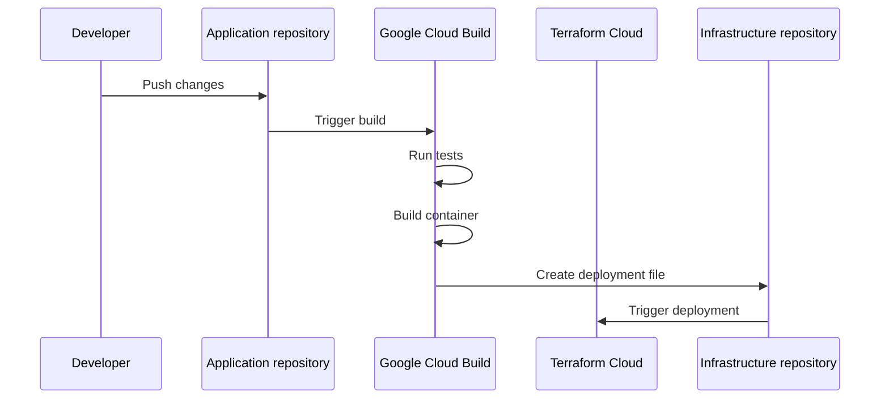

# bun-elysia-template

## About Template

This is simple CRUD (Create, Read, Update, Delete) API template made using [ElysiaJS](https://elysiajs.com).

As the example TCG (Trading Card Game) cards were used. Each card has following properties:

```json
{
    "id": "string required",
    "name": "string required",
    "power": "number required",
    "description": "string optional",
    "created_at": "datetime required",
    "updated_at": "datetime required"
}
```

`id`, `created_at` and `updated_at` properties are generated by application.

`name`, `power` and `description` are passed from the client.

This template is designed for rapid development of APIs using ElysiaJS and Bun, featuring a simple CRUD example to help you get started.

Template is deployed and available at [bun-elysia-template.magicfe.net/docs](https://bun-elysia-template.magicfe.net/docs).

It does not use any database, but it is possible to add one. API respond with dummy data.

We can trigger `404` error for get card by id and update card by id by sending invalid id (any other than `123`).

We can trigger `401` error for create card by sending invalid user role (any other than `admin`).

## Prerequisites

1. Bun installed: `curl -fsSL https://bun.sh/install | bash`

## Getting Started

1. Click on "Use Template" green button or use terraform to create new repository as follows:

```terraform
terraform {
    required_providers {
        github = {
            source = "integrations/github"
            version = "~> 5.0"
        }
    }

    resource "github_repository" "repo" {
        name = "your-repository-name"
        template {
            owner                = "Fairy-io"
            repository           = "bun-elysia-template"
            include_all_branches = false
        }
    }
}
```

2. Clone repository `git clone https://github.com/your-user-name-or-organization-name/your-repository-name.git` (or use ssh)

Don't forget to replace `your-user-name-or-organization-name/your-repository-name` with your github username or organization name and repository name

3. Cd into repository `cd your-repository-name` (use your real repository name)

4. Install dependencies running `bun install`

5. Run `bun dev` to start application

## Commands

```bash
# Run application in dev mode

bun dev
```

```bash
# Create local container

bun containerize
```

```bash
# Deploy

bun run deploy
```

```bash
# Testing (for more informations see Testing section below)

bun tests # run normal tests
bun tests:watch # run normal tests in watch mode

bun e2e # run e2e tests if enabled
bun e2e:watch # run e2e tests in watch mode
```

## Testing

`bun test` will run all tests suites (e.g. `*.spec.ts` files, `*.test.ts` files, etc.).

To separate unit tests from end-to-end tests, we organize them into different directories:

-   Unit tests are placed in the `tests/` directory
-   End-to-end tests are placed in the `tests_e2e/` directory

```ts
// ./tests/file1.spec.ts

import { describe, it } from 'bun:test';

describe('something', () => {
    it('something', () => {});
});
```

```ts
// ./tests_e2e/file2.e2e.spec.ts

describe('something', () => {
    it('something', () => {});
});
```

Then we can run:

-   `bun test ./tests/*.spec.ts` - this will run only tests inside `./tests/file1.spec.ts`
-   `bun test ./tests_e2e/*.e2e.spec.ts` - this will run only tests inside `./tests_e2e/file2.e2e.spec.ts`

This is useful, because sometimes we want to run only normal tests using mocks, but sometimes we want to run e2e tests using real database connections. This pattern allows us to select which tests are running.

### Testing with mocks

If we want to run tests without real database or other dependencies, we can use mocks. We can create mocks for every provider and then use them in tests. We use `mock` function from `bun:test` to create mocks (stored in `tests/mocks` directory).

In Typescript class is also its own interface, so we can use it to create mocks like this:

```ts
import { mock } from 'bun:test';
import { CardsProvider } from '../../src/providers';

export class CardsProviderMock implements CardsProvider {
    public fetchAll = mock();
    public getById = mock();
    public create = mock();
    public update = mock();
    public delete = mock();
}
```

These kind of tests are meant to be fast and simple and they don't need any additional testing setup.

### Testing with real database or other dependencies (e2e)

If we want to be sure that our application works with real database or other dependencies, we can run e2e tests.

## `src` directory structure

```
src/
├── index.ts         # Entry point
├── common.ts        # Shared controller config
├── createApp.ts     # App factory with DI support
├── utils/           # Utility functions
├── onError.ts       # Error handling middleware
├── controllers/     # Route handlers
├── models/          # DTOs and data models
└── providers/       # Data access layer
```

### `index.ts`

Entry point for application. It starts http server.

### `common.ts`

This is common configuration for every controller.

Every controller can use it as follows:

```ts
import Elysia, { t } from 'elysia';
import { ElysiaCommon } from '../common';

const CardsModel = t.Array(CardModel);

export const CardsController = new Elysia({
    prefix: '/cards',
}).use(ElysiaCommon);
```

### `createApp.ts`

File which exports `createApp` method. This method takes optional argument `di` of type `Partial<DiStore>` which is also defined in `createApp`. This is useful for providing dependencies. It returns app instance. This way we can customize it for production and for tests.

### `onError.ts`

This file contains error handling middleware. It is used to handle errors in controllers.

### `auth.ts`

This file contains authentication macro. It is used to authenticate requests. Make sure to add `userRole` to security schemes in `swagger` configuration (or any other security scheme which is required by auth macro).

### `utils`

General utility functions:

-   `validateObject` - Elysia has built in request validator, but it cannot be used outside request context, e.g. for validating environment variables. This function is based on `Typebox` and provides utilities for validating any arbitrary object.

-   `parseIntObject` - This function is parsing any numeric object field (e.g. `{ num: '123' }`) into integers (e.g. `{ num: 123 }`).

### `plugins`

This directory contains different plugins.

-   `di.ts` - dependency injection plugin

#### Dependency Injection (di)

In `createApp.ts`:

```ts
// rest of the code
export type DiStore = {
    CardsRepository: CardsRepositoryInterface;
};

export const createApp = (
    diStore: Partial<DiStore> = {},
) => {
    const defaultDiStore: DiStore = {
        CardsRepository: new CardsRepository(), // this class implements CardsRepositoryInterface
    };

    // rest of the code

    .use(di({ ...defaultDiStore, ...diStore }))

    // rest of the code
};
```

In controllers:

```ts
new Elysia().get(
    ':id',
    async ({ inject }) => {
        const cardsRepository = inject('CardsRepository'); // has correct type already

        // rest of the code
    },
    {
        detail: { description: 'Get card by id' },
        response: { 200: 'Card' },
    },
);
```

### `controllers`

Route definitions and handlers.

### `models`

This folder holds different kind of models.

Each application can use different models:

-   dto (data transfer object) - for defining request body types
-   response models - usually the same as dto, but with additional `id`, `created_at` and `updated_at` properties - for defining response types
-   database models - depends on database which is used or ORM - Elysia is using `t.Object({})` for defining models, but different ORMs are using classes or plain objects to define data structures, so it is necessary to separate it

### `providers`

This folder holds different kind of providers.

Each application can use different providers:

-   data access layer - for accessing database
-   business logic layer - for implementing business logic

#### `config.provider.ts`

It uses `validateObject` and `parseIntObject` functions to parse and validate environment variables. In current setup every environment variable should have value assigned, so it is required to provide default values for optional environment variables.

To get started, create `.env` file based on `.env.example`.

It is async function, because in future it can be used to fetch configuration from external sources (e.g. vault).

## `send` Method

Elysia gives us access to `error` method which can be used for sending custom http code with the specified response, e.g.

```ts
new Elysia().get(':id', async ({ error }) => {
    return error('Not Found', { message: 'Not Found' }); // status code 404
});
```

We can also use this method for returning "non-error" responses as follows:

```ts
new Elysia().get(':id', async ({ error }) => {
    return error('OK', { message: 'OK' }); // status code 200
});
```

But to avoid confusions, we should rename it:

```ts
new Elysia().get(':id', async ({ error: send }) => {
    return send('OK', { message: 'OK' }); // status code 200
});
```

### Benefits

`send` (`error`) method gives us type safety. Let's consider following example:

```ts
new Elysia().get(
    ':id',
    async ({ set }) => {
        // Bad request is not expected to be returned from this endpoint, but typescript is happy
        set.status = 'Bad Request';

        // returned object has missing properties, but typescript is happy
        return {};
    },
    {
        detail: { description: 'Get card by id' },
        response: { 200: 'card' },
    },
);
```

And then using `send`:

```ts
new Elysia().get(
    ':id',
    async ({ error: send }) => {
        // Argument of type '"Not Found"' is not assignable to parameter of type '200 | "OK"'.ts(2345)
        return send('Not Found', { name: '123' });
    },
    {
        detail: { description: 'Get card by id' },
        response: { 200: 'card' },
    },
);

new Elysia().get(
    ':id',
    async ({ error: send }) => {
        // Argument of type '{}' is not assignable to parameter of type '{ name: string; }'. Property 'name' is missing in type '{}' but required in type '{ name: string; }'.ts(2345)
        return send('OK', {});
    },
    {
        detail: { description: 'Get card by id' },
        response: { 200: 'card' },
    },
);
```

## Deploying Application

Template was made with [Google Cloud Platform](https://cloud.google.com/gcp?hl=en) in mind, however it can be adopted to any other cloud provider.

It uses [Depot.dev](https://depot.dev) for building containers, but it is possible to use normal `docker build` command. If you opt for this:

-   create `cloudbuild.yaml` file if you want to use Google Cloud Build
-   create any other configuration file (e.g. `.circleci/config.yaml`) if you want something different

### Dockerfile

Dockerfile is splitted into two stages:

-   `prod` stage creates production ready container, installing production only dependencies and copying `src` directory
-   dev-ops (unnamed stage) creates container which can be used in CI/CD for testing and deploying application. It uses `prod` as base and installs any other dependencies (dev dependencies) and copies `scripts` directory

### Deploy

Application deployment uses [Gitops](https://about.gitlab.com/topics/gitops/). `scripts/deploy/index.ts` reads environment variables and uses template to create or update file in infra repository. Then it is up to other tools like Terraform or ArgoCD to deploy service based on this file.

#### Substitutions

-   `_IMAGE_TAG`: Image tag to be built and deployed (e.g. commit sha)
-   `_IMAGE_NAME`: Image name to be built and deployed (e.g. `gcr.io/$PROJECT_ID/your-image-name`)
-   `_DEPOT_PROJECT_ID`: Depot.dev project Id
-   `_DEPLOY_NAME`: Any arbitrary string which can distinguish different deployments
-   `_DEPLOY_INFRA_REPO_OWNER`: Typically your Github organisation
-   `_DEPLOY_INFRA_REPO`: Name of the infrastructure as code repository. This is repository where deployment file will be created or updated
-   `_DEPLOY_PATH`: The path to the folder where deployment file should be placed (e.g. `terraform`). It should be relative to infra repository root
-   `_DEPLOY_TEMPLATE`: Base64 encoded deployment template. Right now three variables are supported `$image` (image constructed from image name and image tag), `$name` (deployment name) and `$branch` (typically main)
-   `_IS_E2E_DISABLED`: tells if e2e tests are disabled (default `'true'`). It should be a string, not boolean
-   `_GITHUB_TOKEN_VERSION`: secret version from google secret manager which stores Github token
-   `_DEPOT_TOKEN_VERSION`: secret version from google secret manager which stores Depot token

## Deployment Sequence



## Useful Links

-   [ElysiaJS](https://elysiajs.com)
-   [Depot.dev](https://depot.dev)
-   [Google Cloud Platform](https://cloud.google.com/gcp?hl=en)
-   [Google Cloud Build](https://cloud.google.com/build?hl=en)
-   [Gitops Patterns](https://about.gitlab.com/topics/gitops/)

## Contributing

See [CONTRIBUTING.md](CONTRIBUTING.md) for more information.

## License

See [LICENSE](LICENSE) for more information.

## Changelog

### 1.0.0:

-   Initial release

### 1.1.0:

-   Added parsing service name function

### 2.0.0:

-   Added `plugins` directory and `di` plugin
    -   Improved dependency injection
    -   Removed `utils/di.ts` which was causing typescript errors
-   Added `config.provider.ts` to improve testing
    -   `src/config/index.ts` was removed
-   Swagger configuration has been moved to `src/index.ts`
    -   Swagger configuration was removed from `createApp.ts` because it was causing issues during testing and swagger configuration was not needed in tests
-   Added `GET /info` endpoint and tests

#### 1.1.0 -> 2.0.0 migration

```diff
// src/common.ts
-   import { inject } from './utils/di';
+   import { di } from './plugins/di';

-   .decorate('inject', inject)
+   .use(di())
```

```diff
// src/auth.ts
-   import { inject } from './utils/di';
+   import { di } from './plugins/di';

-   .decorate('inject', inject)
+   .use(di())
```

```diff
// src/createApp.ts
+   import { di } from './plugins/di';
-   import {provide} from './utils/di';

-   export const createApp = (di: Partial<DiStore> = {}) => {
+   export const createApp = (diStore: Partial<DiStore> = {}) => {

-   provide({ ...defaultDiStore, ...di });

+   .use(di({...defaultDiStore, ...diStore}))
-   .use(
-       swagger({
-           documentation: {
-               info: {
-                   title: config.SERVICE_NAME,
-                   version: config.SERVICE_VERSION,
-                   description:
-                       config.SERVICE_DESCRIPTION,
-               },
-               components: {
-                   securitySchemes: {
-                       userRole: {
-                           type: 'apiKey',
-                           name: 'user-role',
-                           in: 'header',
-                       },
-                   },
-               },
-           },
-           path: '/docs',
-       }),
-   )
```

```diff
// src/index.ts
-   import { config } from './config';

+   import swagger from '@elysiajs/swagger';

+   import { ConfigProvider } from './providers';

-   const app = createApp();

+   const configProvider = new ConfigProvider();
+   const {
+       SERVICE_NAME,
+       SERVICE_DESCRIPTION,
+       SERVICE_VERSION,
+       PORT,
+   } = await configProvider.getConfig();

-   app.listen(config.PORT);

+   const app = createApp({ ConfigProvider: configProvider });

+   app.use(
+       swagger({
+           documentation: {
+               info: {
+                   title: SERVICE_NAME,
+                   version: SERVICE_VERSION,
+                   description: SERVICE_DESCRIPTION,
+               },
+               components: {
+                   securitySchemes: {},
+               },
+           },
+           path: '/docs',
+       }),
+   ).listen(PORT);
```

```diff
// src/providers/config.provider.ts
+   import { t } from 'elysia';
+   import { parseIntObject } from '../utils/parseIntObject';
+   import { validateObject } from '../utils/validateObject';

+   const configSchema = t.Object({
+       // your schema
+   });

+   type Config = Required<typeof configSchema.static>;

+   export interface ConfigProviderInterface {
+       getConfig(): Promise<Config>;
+   }

+   export class ConfigProvider
+       implements ConfigProviderInterface
+   {
+       async getConfig(): Promise<Config> {
+           const config = validateObject(
+               parseIntObject({
+                   ...process.env,
+                   SERVICE_VERSION: process.env.SERVICE_VERSION
+                    ? `ver. ${process.env.SERVICE_VERSION}`
+                    : undefined,
+            }),
+            configSchema,
+        );

+       return {
+           // your config
+    }

+    private parseServiceName(serviceName: string) {
+        return serviceName
+            .replace(/-/g, ' ')
+            .replace(/\b\w/g, (char) => char.toUpperCase());
+     }
+  }
```

```diff
// src/utils/di.ts
-   remove this file
```

```diff
// src/config/index.ts
-   remove this file
```

Additionally copy [src/plugins/di.ts](src/plugins/di.ts) file into `src/plugins` directory.
